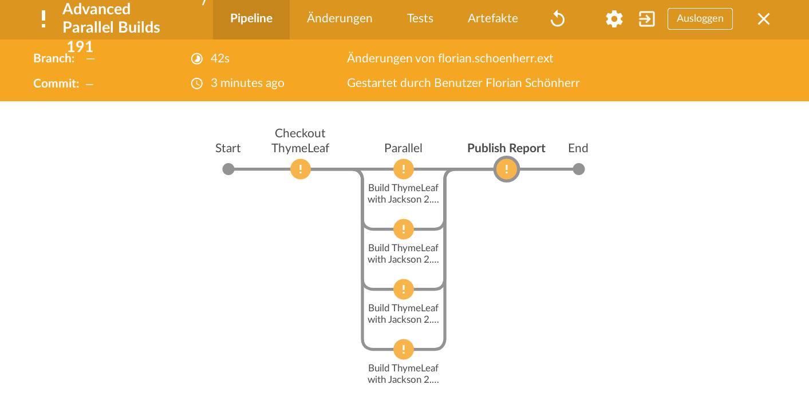

# Parallel builds with Jenkins Pipeline
[toc]

## Introduction
Since the release of Jenkins 2, its scripted pipelines feature has become a de-facto standard for multi-stage builds.


* Reason for this post: There is not a lot of real-world examples for parallel builds
* A note about declarative pipeline, why we don't use it
    * Yet another kind of pipeline
    * Speculating on reasons: Pipeline UI, Jenkins team fragmentation
* Blue Ocean
    * Same as with declarative pipeline: fragmentation
    * Not ready to replace the original Jenkins UI

## Parallel Pipeline - concepts
* The ``parallel`` step
* Dynamically built stages, branch map

### Jenkinsfile structure

The following code snippet presents the general outline of a Jenkinsfile that runs stages in parallel on multiple nodes:

```groovy
node('master') {
    ... Preparation work ...
}

def branches = [:]

for ( iterable ) {

    def branchName = ...

    branches[branchName] = {
        node {
            stage(branchName) {
                ... Run the actual build ...
            }
        }
    }
}
parallel branches

node('master') {
    ... Publish buid results ...
}
```

## A real-world example for using parallel builds
There is a single example for doing parallel builds in the Jenkins pipeline tutorial: [Creating Multiple Threads](https://github.com/jenkinsci/pipeline-plugin/blob/master/TUTORIAL.md#creating-multiple-threads), which shows in detail how to use multiple Jenkins nodes to run unit tests in parallel. While this example provides a lot of information and may actually prove useful, it is quite difficult to apply it to many other possible use cases. One of the main limitations is that it shows how to use multiple nodes within a single build stage, while many possible applications require to parallelize different build _stages_.

In our current project, for example, we are facing the situation that a lot of application modules depend on a specific 'infrastructure' module that is itself under continuous development. Whenever something changes, we need to verify that all dependent modules can be built with the most recent version. In order to improve the duration of this backwards compatibility check, we are using a CI pipeline that runs the integration of all dependent modules in parallel, each as a separate build stage.

Use cases like this one can be found in most companies, but sharing them with the public for educational reasons is often impossible due to disclosure restrictions or because they simply cannot be easily understood by someone outside the project.
This may be the main reason why trying to find a working example for on the internet for parallelizing build stages proves difficult. Most blog entries that cover the ``parallel`` build step provide a rather short introduction and cover the general syntax, but will not go into further details.   

### The example: Integrating Thymeleaf and Jackson
To provide a working example with some real meat to it, we have rather arbitrarily chosen the [Thymeleaf](http://www.thymeleaf.org/) Open Source project, which is a template engine for web servers. It's purpose, however, is actually not very important for us, since we just need a project that has some dependencies.
Thymeleaf uses the JSON parser/generator library [Jackson](https://github.com/FasterXML/jackson). We'll build a CI pipeline that builds Thymeleaf against multiple versions of Jackson (2.8.9, 2.6.3, 2.6.2 and 2.0.0) and produces a report that shows which of them were successful.

# Setup
## Nodes
## Plugins

# The Pipeline Script


/




## Pitfalls
### Serialization of local variable
Authors of Jenkins pipelines learn quickly that it isn't possible to use non-serializable local variables in a pipeline script, except if they are isolated within a separate function. This is described in detail in the respective part of the [pipeline tutorial](https://github.com/jenkinsci/pipeline-plugin/blob/master/TUTORIAL.md#serializing-local-variables).
* [Groovy closures and ``for`` loop variables](http://blog.freeside.co/2013/03/29/groovy-gotcha-for-loops-and-closure-scope/)
* Stashing

## Conclusion
